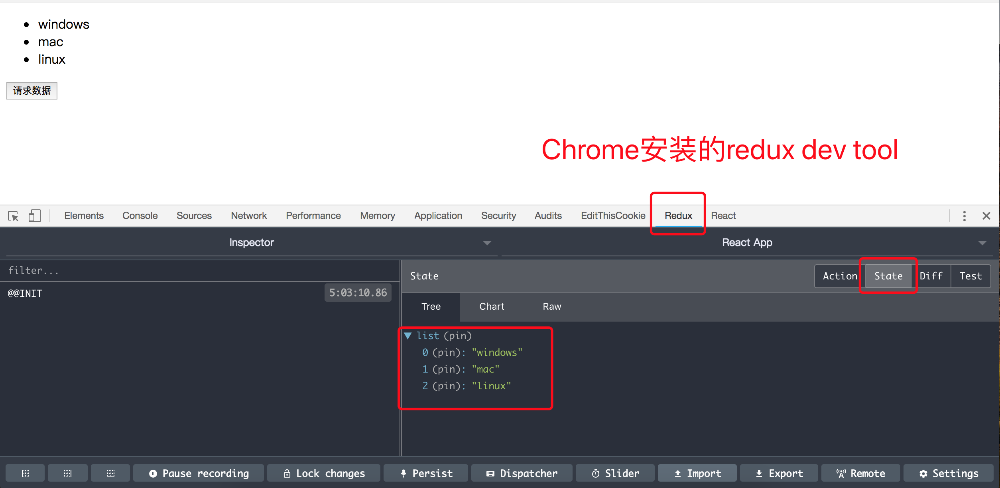
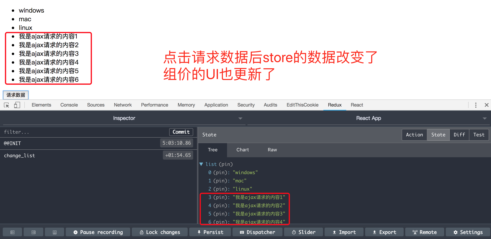

# 运行本项目
> npm install  
> npm start


# 手摸手带你撸redux：四阶(使用redux 的中间件 redux-sage ,异步代码拆分。和redux-thunk二选一)
先说一下redux的工作流程。
- 第一步,创建一个store，相当于一个数据仓库；
- 第二步,React Component根据store里面的state显示UI；
- 第三步,React Component根据需求派发action给store。(dispatch(action))；
- 第四步,store根据React Component派发的action去reducer里面找对应的操作；
- 第五步,reducer告诉store怎么操作数据；
- 第六步,store更新state；
- 第七步,React Component根据store中的state更新UI；

## 1-安装redux-sage
> npm install redux-sage --save

## 2-创建store
--|src  
----|store  
------|actionCreators.js
------|actionTypes.js
------|index.js  
------|reucer.js
------|sagas.js

> actionCreators.js是单独创建action的文件  
> actionTypes.js是存放actio 类型的文件
> index.js 是创建store  
> reducer.js 是告诉store怎么处理数据
>sagas.js 里面处理异步逻辑，处理完成后派发action

### 2.1 - index.js
```js
import { createStore, applyMiddleware, compose } from 'redux'; 
import reducer from './reducer';
import createSagaMiddleware from 'redux-saga';

// 引入异步逻辑
import mySaga from './sages';

// 创建一个sage中间件
const sagaMiddleware = createSagaMiddleware()

const composeEnhancers = window.__REDUX_DEVTOOLS_EXTENSION_COMPOSE__ ?     window.__REDUX_DEVTOOLS_EXTENSION_COMPOSE__({}) : compose;

const enhancer = composeEnhancers(
  // 把sage中间件传入进去
  applyMiddleware(sagaMiddleware)
);
const store = createStore(reducer, enhancer);

// 运行异步逻辑
sagaMiddleware.run(mySaga)

export default store;

```

### 2.2 - reducer.js
```js
import * as actionTypes from './actionTypes';

const defaultState = {
  list: ['windows', 'mac', 'linux']
}

// reducer 可以接收state，但是不能修改state
export default (state = defaultState, action) => {
  switch (action.type) {
    case actionTypes.CHANGE_LIST:
      const newState = JSON.parse(JSON.stringify(state));
      newState.list = newState.list.concat(action.value);      
      return newState;
    default:
      return state;
  }
}

```
### 2.3 actionCreators.js
```js
import * as actionTypes from './actionTypes';


// 这个action是sage内部用来派发的
export const changeList = (value) => ({
  type: actionTypes.CHANGE_LIST,
  value
})

// 这个action是组件中调用的，和saga关联，并执行异步方法
export const getInitList = () => ({
  type: actionTypes.GET_INIT_LIST
})

```

### 2.4 actionTypes.js
```js
export const CHANGE_LIST = 'CHANGE_LIST';
export const GET_INIT_LIST = 'GET_INIT_LIST';

```

### 2.5 sages.js
```js
import { put, takeEvery } from 'redux-saga/effects';
import * as actionTypes from './actionTypes';
import * as actionCreators from './actionCreators';
import axios from 'axios';

// 这个函数用来执行异步方法，并派发改给changeList的action
function* getInitList() {
  try {
    const res = yield axios.get('/api/list.json');
    const action = actionCreators.changeList(res.data.data);
    yield put(action)
  } catch (error) {
    console.log(error);
  }
}

function* mySaga() {
  // 所有使用getInitList的action 都会调用本sage的getInitList方法
  yield takeEvery(actionTypes.GET_INIT_LIST, getInitList);
}

export default mySaga;

```

## 3 组件中派发action
```js
import React, { Component } from 'react';
import store from './store';
import * as actionCreators from './store/actionCreators';
import axios from 'axios';

class App extends Component {

  constructor(props) {
    super(props);
    this.state = store.getState();
    this.getMore = this.getMore.bind(this);
    this.handelStoreChange = this.handelStoreChange.bind(this);
    // 组件订阅store， 当store改变时执行改方法
    store.subscribe(this.handelStoreChange);
  }

  // 当store改变时触发的方法
  handelStoreChange() {
    this.setState(store.getState());
  }

  getMore() {
    const action = actionCreators.getInitList()
    // 实际是派发到saga中间件里面了，
    // saga中异步获取数据后在派发changeList
    store.dispatch(action)
  }

  render() {
    return (
      <div className="App">
        <ul>
          {
            this.state.list.map((item, index) => {
              return (
                <li key={index}>{item}</li>
              )
            })
          }
        </ul>
        <button onClick={this.getMore}>请求数据</button>
      </div>
    );
  }
}

export default App;

```

## 总结
redux-sage和redux-thunk的区别是sage把thunk中的action 异步处理都提出来了,减轻了action的体积，拆分了不同的action

;

;
